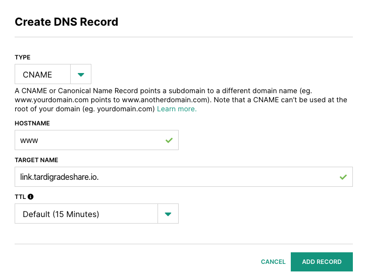

# Link Sharing Service

## Building

```
$ go install storj.io/linksharing
```

## Configuring

### Development

Default development configuration has the link sharing service hosted on
`localhost:8080` serving plain HTTP.

```
$ linksharing setup --defaults dev
```

### Production

To configure the link sharing service for production, run the `setup` command
using the `release` defaults. You must also provide the public URL for
the sharing service, which is used to construct URLs returned to
clients. Since there is currently no server affinity for requests, the URL
can point to a pool of servers:

```
$ linksharing setup --defaults release --public-url <PUBLIC URL>
```

Default release configuration has the link sharing service hosted on `:8443`
serving HTTPS using a server certificate (`server.crt.pem`) and
key (`server.key.pem`) residing in the working directory where the linksharing
service is run.

You can modify the configuration file or use the `--cert-file` and `--key-file`
flags to configure an alternate location for the server keypair.

In order to run the link sharing service in release mode serving HTTP, you must
clear the certificate and key file configurables:

```
$ linksharing setup --defaults release --public-url <PUBLIC URL> --cert-file="" --key-file="" --address=":8080"
```

**WARNING** HTTP is only recommended if you are doing TLS termination on the
same machine running the link sharing service as the link sharing service
serves unencrypted user data.

## Running

After configuration is complete, running the link sharing is as simple as:

```
$ linksharing run
```

## Custom URL configuration and static site hosting*

You can use your own domain for your linksharing and static site hosting with the following setup. 
* We don't recommend utilizing this service for high traffic sites - due to security and cost-efficiency concerns - until we enable access to key shortening and page 
caching.
1. Share your READONLY file or directory via `uplink share --readonly --dns sj://<your path>`. 
The `--dns` flag will print out the info needed to create your dns records.

2. Create your CNAME with our linksharing common URL (`link.tardigradeshare.io.`).
   
    

3. Create 3 TXT records with the following info. You will need to add the entire string (including the prefix) to your records.
   
    a. `storj_grant-1` is the first part of your access grant.
   
    
    
    b. `storj_grant-2` is the second part of your access grant. The two parts don't need to be exactly 1/2 of the entire access grant.
     We require at least 2 strings because of txt record length restrictions. If your access grant is more than 450 characters long, you might need to split it into even more sections.
    
    
    
    c. `storj_root` is the path of the shared object. It may be the path to a bucket, a directory, or an individual object.
   
    
    
    
    
    
4. That's it! You should be all set to share your files or directories with your custom domain.